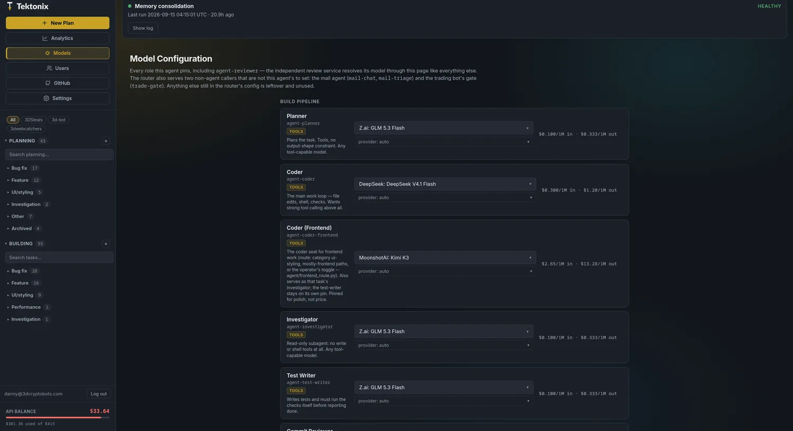
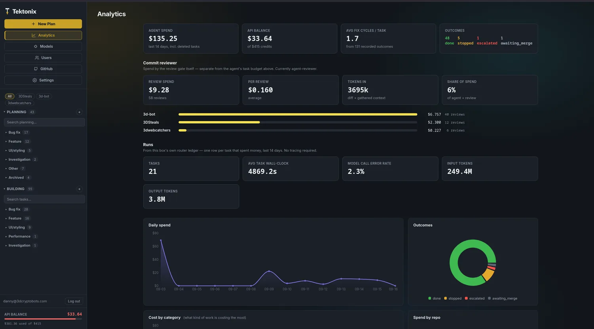
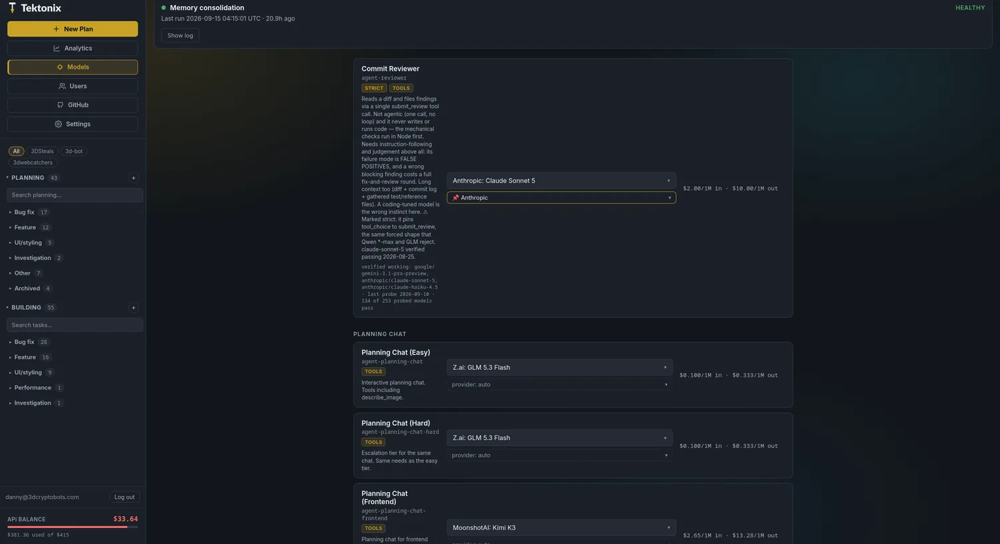
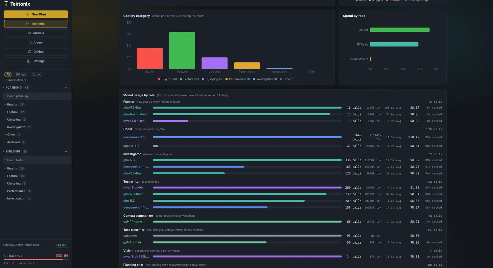
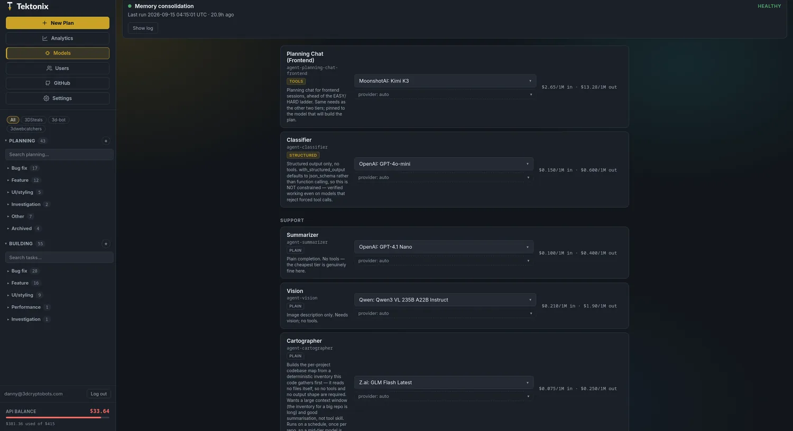
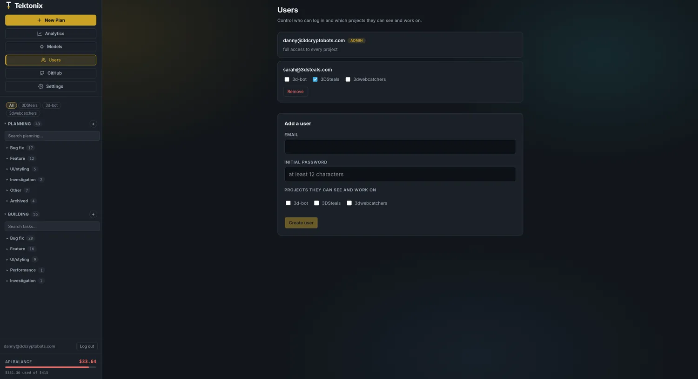
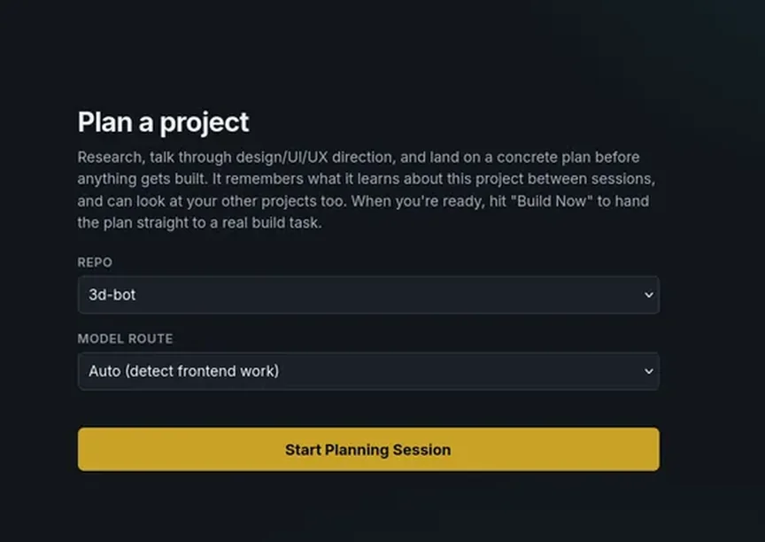

# Tektonix

An autonomous coding agent built on [LangGraph](https://langchain-ai.github.io/langgraph/) and
[deepagents](https://github.com/langchain-ai/deepagents). It plans, executes, and verifies real
changes against a real project checkout, with human approval required for anything risky. It also
runs **Planning Chat**, a separate conversational assistant for research and design discussion that
remembers what it learns across sessions and can hand a finished plan straight to the build
pipeline.

The backend is a FastAPI app (`agent/server.py`); the frontend is React/Vite. Together they cover
submitting and watching build tasks, chatting with Planning Chat, and administering models, users,
and repos.

The agent targets a fixed set of local projects (`PROJECTS` in `agent/config.py` /
`projects.json`). Each task runs against that project's own **workspace** — a git worktree of the
live repo at `/home/agent-workspaces/<project>`, on a per-task branch `agent/<task-id>` — one task per project
at a time, enforced by a Postgres session-level advisory lock (`agent/graph.py`). The lock lives in
the database rather than in the process because the rule is a property of the project: a second
worker, an overlapping restart, or a script run against the same database would each hold their own
in-process lock and happily run two tasks on one worktree. Postgres drops the claim when the
connection closes, so a crashed process releases it with nobody cleaning up.

## Screenshots

<table>
<tr>
<td width="50%"></td>
<td width="50%"></td>
</tr>
<tr>
<td><b>Every role is a named alias you can repin.</b> Planner, coder, frontend coder,
investigator and test-writer each show what the role needs, live pricing and an optional
pinned provider, so a swap is one dropdown rather than a config edit.</td>
<td><b>What it cost and what came of it.</b> Spend against your API balance, average fix
cycles per task, outcomes split into done / stopped / escalated, the review gate's own bill
per repo, and per-task runs from this box's router ledger — no tracing service required.</td>
</tr>
<tr>
<td></td>
<td></td>
</tr>
<tr>
<td><b>Models are probed, not assumed.</b> The reviewer is marked strict — it forces one
tool call — and its card says which models actually pass that, and when they were last
probed, so you find out here rather than mid-task.</td>
<td><b>Where the tokens actually went.</b> Spend by the kind of work and by repo, then
per-role model usage with call counts, tokens, latency, cost and cache hit rate, so an
expensive role is visible instead of inferred.</td>
</tr>
<tr>
<td></td>
<td></td>
</tr>
<tr>
<td><b>Support roles carry the badge their job requires.</b> The classifier needs structured
output and nothing else; summarizer, vision and cartographer are plain completions, so the
cheapest tier is genuinely fine there.</td>
<td><b>A second person gets exactly the projects you tick.</b> Each user sees and works on
the repos they are allowed, and nothing else; the admin has every one.</td>
</tr>
</table>

<details>
<summary>More: starting a planning session</summary>



A planning session starts from a repo and a model route. Auto detects frontend work and
sends it to the frontend seat; the session remembers what it learns about the project
between sessions, and **Build Now** hands the finished plan straight to a build task.

</details>

## Contents

Operating it, rather than reading about it: **[docs/architecture.md](docs/architecture.md)** (the four processes, where each secret lives, the three checkouts, the two-node graph), **[docs/runbooks/](docs/runbooks/)** (symptom → check → action), and **[docs/backup.md](docs/backup.md)** (backup, and proving a restore works). Agreed-but-unbuilt work is in **[docs/todo.md](docs/todo.md)**.

- [How a build task runs](#how-a-build-task-runs)
- [Planning Chat](#planning-chat)
- [Frontend routing](#frontend-routing)
- [Dashboard](#dashboard)
- [Telegram alerts](#telegram-alerts)
- [GitHub inbox](#github-inbox)
- [Memory](#memory)
- [Model routing](#model-routing)
- [Auth](#auth)
- [Attachments](#attachments-images-pdfs-csvs)
- [Repo layout](#repo-layout)
- [Running it](#running-it)
- [Configuration](#configuration)
- [Adding a project](#adding-a-project)
- [Operating it](#operating-it)
- [Testing](#testing)
- [Tracing and secret redaction](#tracing-and-secret-redaction)
- [Connection resilience](#connection-resilience)

## How a build task runs

`agent/outer_graph.py` wires a small, two-node graph around a deepagents agent
(`agent/deep_agent.py`):

```
START → work → verify_and_ship ──(findings / unfinished plan)──→ work (loop, same inner thread)
                    │
                    ├──(escalated / awaiting approval / awaiting merge)──→ END (resting; resume continues)
                    └──(READY + merge allowed)──→ merge+deploy (inside this node) → END
```

- **`work`** (`agent/nodes/work.py`) drives the deep agent's own tool-calling loop against a
  sandboxed checkout (`docker/agent-sandbox/` — only the target repo is mounted, so a shell command
  can't reach other projects or host secrets). It plans via `write_todos` and can delegate to two
  subagents: **investigator** (read-only research — no write/edit/shell tools at all) and
  **test-writer** (writes tests, required to run the checks itself before reporting done). A
  `run_checks` tool lets it run the project's real typecheck/lint/test suite itself mid-task — the
  same commands the gate will run — so it finds its own breakage rather than learning about it a
  full round-trip later. On a frontend-routed task the coordinator and investigator sit on
  `agent-coder-frontend`; the test-writer keeps its own pin (see [Frontend routing](#frontend-routing)).
  With a GitHub token it can also **read a pull request** host-side (`github_pull_request`) — the
  sandbox never sees the token.
- **`verify_and_ship`** (`agent/nodes/verify_and_ship.py`) is the actual gate. It always re-runs the
  real typecheck/lint/test suite itself — the agent's own "done" status carries no authority here.
  A check that fails on the branch is re-run at the merge-base; one that fails there too is marked
  **pre-existing**, does not force `NEEDS_FIXES`, and is listed for the agent with an instruction
  not to chase it. A pass with a real diff produces one commit on the task's own branch `agent/<task-id>`, handed to
  an independent review service. The review unit is that **branch plus its merge-base**, fixed at the
  fork point — not "whatever the sandbox HEAD is now". The old model compared two HEADs and inferred
  the rest, which produced inverted diffs whenever live moved ahead: a branch's additions read as
  deletions of everything live had gained since, and that manufactured two `blocking` findings
  against a commit that had in fact *added* the settings it was accused of removing.
  From there:
  `NEEDS_FIXES` loops back to `work` with the findings; `READY` merges and deploys (after the
  operator's merge approval, unless that switch is off). Merge and deploy live **inside this
  node**, not as a third graph node — a deploy preflight can fail as its own stage (a live URL
  the build depends on is down) and escalate to a human rather than being handed to the agent as
  a compile error.
- **The plan has to be finished before anything is committed.** If the agent's own `write_todos`
  list still has open items, the gate holds the commit and sends it back to finish, naming what's
  left. Committing mid-plan means the review service reviews a deliberately-incomplete change and
  correctly reports the not-yet-written pieces as defects — bouncing the task on findings that
  describe scheduled work. It's a nudge budget, not a hard gate: a model that stops maintaining its
  own list can't strand working code as an uncommittable diff forever.
- Two limits the model can't override: a **budget ceiling** (`BudgetGuardMiddleware`, checked after
  every model call, on both the coordinator and every subagent) and an **iteration/retry ceiling**
  on the work/verify loop. The ceiling is enforced against **what the router billed**, not a token
  × rate-table estimate: each call is carried at its estimate only until the router's line for that
  call id lands (`agent/tools/router_ledger.py`), then the billed figure replaces it. A planning
  turn was once ended at "$8.09 spent" when OpenRouter had billed $1.72.
- **Loops end.** A third identical tool call whose two predecessors returned the same result is
  answered from cache; the fourth and later are refused; after eight refusals in a row the pass
  escalates naming the looping tool (`RepeatCallGuardMiddleware`). A call whose result changes (a
  poll, a flaky test) is never blocked. Malformed tool calls are stripped from every model request
  (`SanitizeToolCallsMiddleware`) so a truncated `write_todos` cannot poison every later turn of
  the thread.
- **`ask_user`** lets the agent pause and ask the operator a clarifying question mid-task instead of
  guessing, using the same human-in-the-loop interrupt that gates approval-required actions.
- **A task is never a dead end.** Escalated, stopped, budget-exhausted, or orphaned by a backend
  restart mid-run — each has a way back in. The full graph state lives in the checkpointer, so
  resuming adds budget and continues the same inner thread rather than starting over. The dashboard
  detects an orphaned task (the store says "running" but nothing is driving it) and offers a resume
  instead of leaving it stuck looking busy forever.

## Planning Chat

A separate agent (`agent/planning_chat.py`) for research, design discussion, and scoping a project
before anything gets built. No write/bash access to the real repo — just research tools (web
search, a headless-browser `browse_page` with screenshots, `describe_image`, read-only access to
your other projects, `search_project` / `find_files` against the real tree, optional GitHub PR
and inbox tools) and `save_brief` / `save_plan`. "Build Now" hands a finished plan to the real build
pipeline above, as if it had been typed in directly. The app lands here first: Planning Chat is
the front door, not the raw task composer.

**Three seats, chosen automatically** (pins are dashboard-editable; current picks shown):

| Seat | Model (dashboard alias) | Used for |
|---|---|---|
| Frontend | `agent-planning-chat-frontend` — Kimi K3 | UI/UX sessions. Sits **ahead** of the EASY/HARD ladder so the plan is written by the model that will build it |
| EASY (default) | `agent-planning-chat` — DeepSeek V4 Pro | Research, design/UX chat, everyday questions |
| HARD | `agent-planning-chat-hard` — Qwen3.8 Max | Bug hunting, debugging, genuinely hard problems |

The EASY pin's provider caches implicitly, no plumbing needed. The HARD pin used to be Claude
Sonnet 5 and carried Anthropic `cache_control_injection_points`; those extras were removed with
the Qwen repin (dropping sampling params on Qwen silently un-pinned `temperature=0`). If HARD
ever goes back to an Anthropic model, both must return.

Difficulty is classified fresh every turn (`classify_task` in `agent/classify.py`; a `"bug-fix"`
category escalates, and a small keyword floor catches an explicit request for maximum effort), then
**sticky upward** within a session: a short follow-up ("continue", "also check X") classifies EASY
on its text alone and used to flip the model mid-plan. Once a session has needed HARD, later turns
stay there. Frontend routing is sticky the same way. Both (all three) seats get the identical tool
list, memory, and permissions — only the model itself changes.

**The brief comes first and stays pinned.** `save_brief` is the only tool a new session can call
until a brief exists (`BriefFirstMiddleware`); the brief rides in the system message on every call
after that (`PinnedBriefMiddleware`), so compaction cannot touch it, and it persists with the
session so follow-up turns do not re-force it. Saving the brief also matches the request against
the project's skills and names the architecture skills to read before any file.

**Search, then read the window a hit points to.** `search_project` (ripgrep, capped per file and
overall) and `find_files` (the `.gitignore`-aware file list) against the real repo. Loop-proofed:
an identical search is answered from cache and refused on the third; zero hits come back with what
was scanned and what to change; a per-turn search budget ends searching with "write the plan from
what you have". Both are dials under **Settings → Runtime limits**.

**The draft gate.** After N repo reads without a saved plan (default 50) `read_project_file` closes
with "save a draft now" and reopens once a plan is saved. A gate-forced save is a checkpoint, never
the end of the turn. Paged reads return at least 500 lines whatever `limit` asks.

**Deliberate constraints, each earned by a real incident:**

- **No subagents.** `create_deep_agent` auto-adds a general-purpose subagent (and its `task` tool)
  even when none are declared; planning hides it at both the schema and execution layer
  (`agent/middleware/hidden_tools.py`). A hidden delegation primitive once burned a 30-minute turn
  timeout on nested agent loops. Built-in `glob`/`grep` are hidden for the same reason — they
  search the agent's own memory/skills space, never the repo, and a model will loop on the
  misleading "No matches found" forever. The repo search is `search_project` / `find_files`.
- **Codebase-map first.** The cartographer's per-project map (`/skills/codebase-map/SKILL.md`) is
  advertised in the prompt and read before any directory walking — one read replaces a dozen
  exploratory listings. The map refreshes every 30 minutes by cron (hash-gated: an unchanged repo
  costs a tree walk, no model call) and immediately after every merge+deploy. A companion
  `recent-changes` skill lists the newest commits with their files.
- **Large files page.** `read_project_file` supports `offset`/`limit`; a truncated read says
  outright that re-requesting returns identical text and names the exact next call to make.
- **A per-turn dollar ceiling** (Settings → Runtime limits, `planning_turn_budget_usd`, default $4;
  also seedable from `PLANNING_TURN_BUDGET_USD`) on top of whatever the session already spent.
  Planning previously ran uncapped — the one agent with no budget was the one that once spent $7
  on a single 157-call turn. On breach the draft plan and real cost are banked and the operator
  decides whether another turn's allowance is worth it.
- **A plan written as chat text is not lost.** A turn that ends with a plan-shaped final message
  and no `save_plan` call has that text adopted as the draft (narrow heuristic; an explicit save
  always wins).

**The agent can propose a project that does not exist yet.** When a request turns out to be a new
application rather than a change to the current project, the planning agent asks for a name and
whether to create a private GitHub repo, restates both, and only after the operator confirms calls
a `create_project` tool. The tool creates nothing: it records a proposal, and the dashboard shows a
confirm card ("The agent proposes a new project: *name*") with **Confirm** and **Dismiss**. Confirm
(`POST /api/planning/sessions/{id}/new-project`, admin only) creates the project through the same
path as [Adding a project](#adding-a-project) and moves the session onto it, so the conversation
continues against the new repository; a non-admin is told that an admin must confirm. The proposal
is inert until a person with the right to click does — a model that could create repositories by
calling a tool would be one that could create them by being asked to in a pasted document.

With a GitHub token, `github_pull_request` / `github_pull_requests` read a PR host-side. The inbox
tool `github_inbox_items` lists what the poller found — for code scanning items the locations in
the summary **are** the findings.

## Frontend routing

The operator can pin frontend work to a different model than everything else
(`agent/frontend_route.py`). Polish is decided at the keyboard, so the seat that matters is the
coder (and the investigator that reads for it); the test-writer stays on its own pin.

Three signals, strongest first, plus a switch the operator flips on the New Task form, Build Now,
or a new planning session:

1. **Override** — `frontend` or `general` beats everything.
2. **Category** — the classifier's `ui-styling` is the strongest evidence a model read the whole goal.
3. **Backend** — any named backend path (`api/`, `prisma/`, a `.sql` file) or backend keyword
   (migration, schema, endpoint) routes **general**. Database work that also has a UI is still
   backend work.
4. **Paths** — a clear majority (two thirds) of named frontend files routes frontend; mixed stays
   general.
5. **Keywords** — two distinct hits on a short UI list (`layout`, `theme`, `css`, …).

Every decision carries a **reason**, shown on the task/session as a route badge — silent routing
is how an expensive frontend-seat run on a backend refactor happens. Planning sessions decide on
their first message and stay put. On a frontend task the coordinator and investigator use
`agent-coder-frontend`; planning uses `agent-planning-chat-frontend`. Both frontend seats are
managed roles on the Models page.

## Dashboard

One React/Vite app (`frontend/`), served by the backend itself, at its own host. Signed out means
the sign-in form. The public page is a separate build (`site/`) on its own host and is not part of
an installation, since a self-hosted Tektonix has no use for a page selling it. On this deployment
that is `agent.tektonix.io` for the console and `tektonix.io` for the page; your own install has
whatever single host you point at it. Live task and planning output arrives over WebSockets, with a
REST snapshot on every (re)connect — the socket only carries events from the moment it opens, so
the snapshot is what makes a page opened mid-task show real history instead of starting blank.
Multiple people can watch the same task at once; a second viewer connecting doesn't disconnect the
first. The app lands on **Planning**, not the raw task composer.

- **Sidebar** — Planning sessions and build tasks, each grouped by the same six-way category the
  classifier assigns (`bug-fix`, `feature`, `ui-styling`, `performance`, `investigation`, `other`),
  with search. Running tasks sit in their own always-visible group at the top, so a refresh mid-task
  never buries the thing you're watching inside a collapsed category. Finished planning sessions
  archive into a collapsed group rather than growing one endless list. Each item can show a
  **route badge** (frontend / general) with the reason on hover.
- **Mobile** — the app works on a phone, not just a narrow desktop. A bottom tab bar puts every
  destination in the thumb zone (navigation previously lived only in the sidebar, which *is* the list
  pane on a phone, so reaching Analytics took three gestures), safe-area insets keep content clear of
  the notch and gesture bar, and tap targets meet the 44px floor. Verified by rendering at 412x915
  with a headless browser rather than by eye.
- **Installable** — the dashboard is a Progressive Web App: Chrome on Android offers *Install app*,
  and iOS Safari's *Add to Home Screen* does the same, both giving a launcher icon and a standalone
  window with no browser chrome. One codebase, no app store, no separate build. The service worker
  (`frontend/public/sw.js`) deliberately does **not** provide an offline mode — this is a console
  onto a live agent, and cached task state would be a screen that lies — so it never touches
  `/api` at all and serves the app shell network-first, falling back to a cached copy only when the
  box is genuinely unreachable. `tests/test_pwa.py` pins each of Chrome's installability criteria,
  because Chrome reports a failed one only in DevTools.
- **Removing a project** — **Settings → Projects**, expand a project, *Remove from Tektonix*. The
  agent forgets it: the worktree it built in, the deploy key it minted, its configuration entry and
  its memory. **The live repository is never touched** — not a file, not a branch the agent pushed,
  not the remote. The one thing changed inside it is `core.sshCommand`, unset because the agent set
  it when it minted the key, and leaving it would point your own git at a key that no longer exists.
  You choose what happens to what the agent *learned*: **archive** writes its memory, generated
  skills, planning sessions and task history to a file under `archives/`, and adding a project of
  the same name again offers to restore it; **delete** removes it outright. Removal is refused
  while a task or planning turn is in flight, and the confirmation asks you to type the project's
  name, because the button sits one row away from a project that was working fine.
- **Push notifications** — the installed app gets the same alerts Telegram carries (a task
  finishing, escalating, or waiting on approval), scoped by the same rule to the projects the
  account can see. `agent/notify.py` fans out to both transports from one place on purpose: two
  fan-outs are two chances for the scoping to drift and start telling a single-repo user about
  every project. Permission is per device, so each phone or laptop is enabled separately in
  **Settings → Notifications**; on iPhone it only works once the app is on the Home Screen, and
  the panel says so rather than offering a button that cannot work. The VAPID keypair is generated
  once into `keys/vapid.json` and never rotated, because regenerating it silently invalidates
  every existing subscription.
- **Colour schemes** — five, chosen per account in **Settings → Appearance**: Drafting (the
  original brass), Indigo, Orchid, Ember and Moss. The preview pane is the scheme rather than a
  picture of one — it carries `data-theme` and the same `[data-theme]` blocks in `theme.css` paint
  it — so it cannot drift from what Save applies. Every foreground in every scheme is measured
  against its own surface and clears 4.5:1, and `tests/test_themes.py` computes those ratios
  rather than trusting the comments. State colours (running, waiting, done, failed) deliberately
  do not change with the scheme: a colour that means something must not move with a preference.
- **Consolidation status** — nightly memory-consolidation health on the Models tab: healthy, stale,
  failed, or never-run. That last state is the one a log tail can never show you: if cron stops
  firing entirely, an empty log looks exactly like a quiet night.
- **Analytics** (admin only) — computed from this box's own records: the router's per-call ledger
  (`services/model-router/logs/routing.jsonl`) and the work node's tool-result log. Per-role model
  usage carries two columns traces never could — what the router was **billed**, and how much of
  each prompt the provider served **from cache**. Spend by day, by project, and by category; the **commit reviewer's**
  own spend as its own section (the agent's budget and the gate's are different things, and until
  2026-08-25 the reviewer called OpenRouter directly and never read the response's `usage`, so its
  cost was structurally invisible here); per-role model usage with
  token counts and latency; tool-call reliability and error rates; and per-task outcomes. Backed by
  LangSmith run data plus the episodic records `verify_and_ship` writes.
- **Models** (admin only) — the model-pin editor described under [Model routing](#model-routing).
- **Users** (admin only) — create accounts, scope them to specific projects, revoke access, and
  grant auto mode **for named projects** rather than globally.
- **Audit log** (admin only, Settings) — who onboarded or created a project, who approved or rejected a
  specific gated command, who approved a merge, who moved auto mode or merge review and for whom,
  who set a GitHub source to Auto, who generated a deploy key, and which inbox items were approved
  by a click, a signed link, or the poller itself. Kept in the same database as your tasks.
- **GitHub** (admin only) — the inbox tab: proposed items, approve / dismiss / snooze, and a
  per-repo filter. Settings for it live under Settings → GitHub.
- **Approvals inline** — when the agent hits a gated action or calls `ask_user`, the request appears
  in the task stream with approve/reject/answer controls; the answer goes straight back into the
  same paused thread. Past two minutes of silence on a running task the stream shows a *no activity*
  banner: the socket is alive and heartbeating, so the quiet is the agent's, not the connection's —
  the opposite diagnosis from a dead socket, which the page now detects and reconnects from on its
  own after 70 seconds. The New Task form, Build Now and the new-session panel carry an
  Auto / Frontend / General selector.
- **Credit balance** — remaining router credit sits in the sidebar and turns red under 15%, so
  running dry is something you see coming rather than discover through a failing task.
- **Project filter** — a chip row above the sidebar lists (All + one per repo) filters Planning and
  Building together; category grouping stays intact underneath.
- **Task identity** — the task header carries click-to-copy `id:` and `commit:` chips, so "which
  task are we talking about" has a definite answer; every tool bubble in task and planning streams
  is timestamped, so stale scrollback and live activity are distinguishable at a glance.
- **Settings** — themed sections (Account & access / Agent behavior / Runtime limits / Notifications
  & projects / GitHub / API keys & integrations) in a responsive two-up grid; the API-keys panel is
  one card per credential group (Model routing, Tracing, Email) with a single panel-wide save.
  **Runtime limits** are operator-tunable without a restart: planning read/search/turn budgets, model
  and sandbox timeouts, check-suite timeouts, default task budget. A change lands on the next turn
  or task; anything already running keeps the limits it started with. Each project card also holds
  that project's **deploy key** (generate or paste, test the remote, HTTPS origins flagged because
  an SSH key cannot authenticate them).

## Telegram alerts

Per-user opt-in (Settings → Telegram alerts: bot token + chat id; the token is write-only — the
backend returns only a masked view and the UI sends an unchanged-sentinel, so no user-serializing
endpoint can leak it). Every alert carries details **and cost so far**:

- task **escalated** (reason), **awaiting approval** (the exact prompt), **awaiting merge** (sha),
  **done**, **error** — one buzz per distinct stop, deduped across stream cycles; `running` and
  operator-initiated `stopped` never alert
- **planning turn failed** (error + session cost)
- task **auto-resumed** after a restart
- **service watch**: a lifespan-owned poller checks `pm2 jlist` each minute and alerts on any other
  service restarting, going down, or vanishing; the agent backend announces its own startups
  instead (its restart resets the watcher living inside it), which doubles as the deploy-landed
  signal

Alerts are best-effort by construction (`agent/notify.py`): a Telegram outage can never break or
slow the thing it is alerting about.

## GitHub inbox

The agent can pick work up from GitHub instead of waiting to be told (**Settings → GitHub**, admin
only; the inbox is a tab of its own). Five sources, each with its own policy per project:

| source | what it is |
|---|---|
| Dependabot pull requests | open PRs by `dependabot[bot]` (widen to any bot, or anyone) |
| Dependabot security alerts | open alerts on the repo's security tab (needs *Dependabot alerts: read*) |
| Code scanning alerts (CodeQL) | open alerts on Security → Code scanning, **one inbox item per rule** so a task fixes every location of the same finding together (needs *Code scanning alerts: read*). The task fixes the cause in this repository; it never dismisses the alert on GitHub |
| Review comments requesting changes | an open PR with a `CHANGES_REQUESTED` review still standing |
| Failing checks on the default branch | a check run that concluded failure on the tip of `main` (needs *Checks: read*); if the token has only *Actions: read*, the newest workflow runs on that branch are used instead (Dependabot's own update jobs excluded) |

Policy is **Off** (listed, nothing else), **Propose** (put it in the inbox and send an approve link)
or **Auto** (start the task at once, up to the project's cap on open auto tasks). Auto removes only
the click that starts a task: it still runs the review gate, and it always keeps the operator's
final merge approval — nothing an inbox task does reaches the default branch without you, whatever
any account's preferences say. Gated file and shell actions follow your own per-project Auto
switch, the same as a task you typed. That used to be forced on: a Dependabot task could not change
a version string in `package.json` without a click per file it touched, which made a critical
security fix slower to land without making it safer — the gate that actually guards the repo is the
merge one. Each project also sets the budget per
inbox task and which coder seat it goes to.

**Auto needs a gate with something in it.** A project whose review runs no mechanical checks — no
tests, no lint, no build — cannot be set to Auto: saving is refused with the reason, and if a
project's checks disappear later its items are proposed instead of started. Otherwise "auto" would
mean shipping work that a model's opinion alone had verified. Propose always works.
A brand-new project therefore starts on Propose: it has no checks until its first merge lands,
at which point detection runs on its own and writes them (see [Adding a project](#adding-a-project)),
and from then on Auto is accepted. Nothing has to be added by hand — the manual "add checks"
step that the refusal used to point at happens by itself.

Every start is recorded in the audit log, including the ones nobody clicked: an approve link
appears as *signed link*, and the poller's own auto-start as *github-inbox*.

Approve links go out over Telegram and, optionally, email. The link is public but carries a signed,
expiring (48 h), single-use token; it opens a confirmation page with one button, and only the button's
POST acts — a GET never does, because messengers fetch links for previews. Without a dashboard URL
configured, alerts say to open the inbox instead.

Tokens are fine-grained PATs stored encrypted with the same key as TOTP secrets; the dashboard sees a
name, the last four characters and a **Test** button that reports which projects the token reaches and
whether it may read alerts, code scanning and checks. A project without a token falls back to `GITHUB_TOKEN` from `.env`. The
poller runs inside the backend every *poll interval* minutes (default 10) while any source is on; a
PR is proposed once, a dismissed one stays dismissed until its head commit changes, a snoozed one
returns when the snooze expires, and one that closes on GitHub is marked resolved. A project
configured before code scanning existed inherits that source's mode from its Dependabot-alert
policy until the operator sets it explicitly.

## Memory

Each project has its own persistent memory file, `/memories/AGENTS.md`, backed by the same Postgres
store as the LangGraph checkpointer. The agent can read and write it directly during normal work,
and it's shared across every task and planning session for that project. A second file,
`/org-memory/AGENTS.md`, is shared read-only across all projects.

- **Episodic memory** — `verify_and_ship` records a short summary (goal, outcome, cost, review
  verdict) at the end of every task. Not loaded into context by default; it feeds consolidation.
- **Consolidation** (`agent/consolidation.py`, run nightly via
  `scripts/consolidation-cron.sh`) reads a project's recent episodes plus its current memory and
  distills durable patterns into an updated memory file, skipping one-off noise.

  It uses `ProviderStrategy` for structured output, not a bare schema. Passing the schema alone
  resolves to `AutoStrategy`, which picks a **forced tool call** — and every OpenRouter provider for
  the `qwen*-max` family rejects `tool_choice=required/object` while the model is in thinking mode.
  That failed the nightly run for any project with episodes to consolidate, silently: projects with
  nothing to do short-circuit before the tool call and return success, so the log looked healthy.
  Probed on the real shape, `bare(Auto)` and `ToolStrategy` both FAIL on `qwen3.8-max` where
  `ProviderStrategy` passes.

  It also **fails loudly** now. `run_consolidation.py` exits non-zero with a banner naming the failed
  projects, and the cron wrapper writes `data/last_consolidation.json` for the dashboard's
  consolidation panel. Previously it printed a line and exited 0, which is why a broken run was
  indistinguishable from a healthy one.
- **Freshness.** Memory has no timestamps of its own. The cartographer keeps a ledger of which
  memory lines cite which files, and flags a fact whose cited file changed after the fact was first
  seen (`agent/memory_freshness.py`). Those flags ride into both agents' memory blocks — a hint, not
  a deletion. A `recent-changes` skill (newest commits with their files) is rebuilt with the map.
- `scripts/seed_memory.py` seeds a project's initial memory. Live memory lives in Postgres, not in
  the repo — `memory/` holds only `*.example.md` templates showing the expected shape; real
  per-project memory files are gitignored.
- **Skills** (`skills/`) hold larger, situational domain knowledge that would bloat the memory file
  if always loaded — only a name and one-line description sit in the system prompt by default, and
  the agent reads the full skill file itself when a task actually needs it. The repo is the source
  of truth: authored skills live at `skills/<name>/SKILL.md`, vendored external ones under
  `skills/vendor/<name>/` (pinned + reviewed, see each PROVENANCE.md), and
  `scripts/seed_skills.py` deploys them to the project stores (re-running is the upgrade path).
  `webapp-testing` (vendored from anthropics/skills, Apache-2.0) plus Playwright/Chromium in the
  sandbox image lets the build agent render a frontend headlessly, screenshot it, and READ the
  screenshot with `describe_image` — UI work is verified visually, not just by compile.

## Model routing

Every model the agent uses is a named alias (`agent-planner`, `agent-coder`,
`agent-coder-frontend`, `agent-investigator`, `agent-test-writer`, `agent-summarizer`, `agent-vision`,
`agent-consolidator`, `agent-cartographer`, `agent-classifier`, `agent-planning-chat`,
`agent-planning-chat-hard`, `agent-planning-chat-frontend`,
`agent-demo-chat`, `agent-reviewer`) pinned in the router's config. They're edited from the **Models** tab in the dashboard
(`GET`/`POST /api/model-config`) — swapping a role's model is a dashboard action plus a router
restart, no code change or redeploy. `agent/model_config.py` only ever touches these `agent-*`
entries; the router config is shared with other services, and edits are a surgical text
replacement so everything else in the file is untouched.

That config (`services/model-router/config.yaml`) is **yours, not the repo's**. It is gitignored and
seeded once from `config.example.yaml` by `install.sh`: the Models page rewrites it every time you
repin a role, so tracking it would make each model change a diff to explain, and an upgrade could
overwrite the pins you chose. The example's pins are one deployment's answers on one day — a shape
that works, not a recommendation. Keep your copy with your backups, since git has no version of it
to restore.

### Picking a model for a role

The Models tab marks every role on three axes, because they fail independently:

| axis | meaning |
|---|---|
| `tools` | the role hands the model callable tools |
| `structured` | the role constrains the output shape |
| `strict` | the model is **forced** into a response shape — tools + structured output in one request (Consolidator), or `tool_choice` pinned to a function (Reviewer) |

`strict` is the axis that actually restricts your choice, and **only two roles have it**. Everywhere
else, pick freely.

OpenRouter's catalog cannot answer the strict question. `qwen3.8-max` advertises `tools`,
`tool_choice`, `structured_outputs` **and** `reasoning` — byte-identical to
`gemini-3.1-pro-preview`, which works — and its per-endpoint data claims the same.
`supported_parameters` is a flat union across providers and cannot express a refused *combination*.
Only a real request settles it, so `scripts/probe_forced_tool_call.py` sends the actual shape and
caches the result; the Models tab has a **Refresh model list** button that re-runs it.

Verified for the strict roles (2026-08-25): `gemini-3.1-pro-preview`, `claude-sonnet-5` and
`claude-haiku-4.5` pass. `qwen3.8-max` fails by returning 200, silently skipping the tool and
inventing an answer — the dangerous variant. `glm-5.3` fails with a 404, `glm-5.2` with unparseable
JSON.

All `agent-*` pins carry OpenRouter's `require_parameters`, which routes only to providers
supporting every parameter in the request. Compliance is **per-provider** and OpenRouter
load-balances, so the same model can pass one run and fail the next — treat the probe as a strong
filter, not a guarantee, and pin the provider explicitly for anything that must not break.

The coordinator splits its own work between two of those roles deterministically, no classifier
involved: the first turn of a fresh thread (writing the plan) goes to `agent-planner`; every turn
after that goes to `agent-coder` (`agent/middleware/model_pin.py`) — or `agent-coder-frontend` when
the task routed frontend.

## Auth

Username/password with TOTP 2FA (`agent/auth.py`): argon2id password hashing, RFC 6238 TOTP with
one-time recovery codes, and a single opaque session cookie that's revocable server-side rather
than a JWT. Per-user repo access is an explicit allow-list for a restricted account, or
unrestricted for `role="admin"`. The first admin account is seeded automatically on first startup
with a random password, printed once to the server log and required to be changed at first login
(see `ADMIN_EMAIL` below).

### Two operators, not one

Two things change once a second account exists.

**Auto mode is per project.** The switch that lets a task run without stopping for approval has
two halves — the operator's intent, and the projects they intended it for. Both must agree before
a task skips a prompt, so auto mode on a scratch project never means auto mode on production, and
a new account cannot inherit it everywhere by copying the first admin's defaults. Turning it on
requires naming projects; there is deliberately no "all projects" option. A GitHub inbox task has
no session to read, so it resolves the same two-part rule from the admin accounts instead, and
fails closed if it cannot read them. A deployment upgrading
from the single global switch has its existing accounts scoped to their current projects once, at
startup, so nothing changes behaviour silently.

**Who changed what is recorded.** An append-only audit log in the same Postgres store as tasks and
memory (`agent/audit.py`, shown on the Settings page, admin-only): who onboarded a project, who
approved or rejected a specific gated command and what it was, who approved a merge, who moved
auto mode or merge review and for whom, who set a GitHub inbox source to Auto, who generated or
deleted a deploy key. Telegram alerts are a notification channel — best-effort, unordered, and
deleted at the whim of whoever owns the chat — which is exactly why they are not the record.

Writing the log never blocks the action it records: a failure is logged and the request proceeds.
That is a deliberate trade, and worth knowing when reading the page as evidence.

## Attachments (images/PDFs/CSVs)

Both the build-task composer and Planning Chat can attach reference files through the same
`/api/uploads` endpoint. Files land in the target repo's sandbox under `.uploads/<batch>/`,
excluded from git so they never appear in a diff or commit. A PDF gets a sibling `.txt` with
extracted text; images are read through the agent's `describe_image` tool. The upload manifest is
appended only to what the model sees, never to the visible chat text or to what gets classified.

## Repo layout

```
agent/
  server.py            FastAPI app -- routes, WS streams, background task runners
  outer_graph.py        the 2-node work / verify_and_ship graph
  graph.py               shared infra: Postgres checkpointer + store, per-project lock
  deep_agent.py          per-task deepagents factory (tools, memory backend, subagents)
  planning_chat.py       the Planning Chat agent
  frontend_route.py      Auto / Frontend / General seat selection
  github_inbox.py        poller, policy, approve-link tokens
  github_settings.py     encrypted PATs and per-project source policy
  auth.py / mailer.py    login/2FA/session/password-reset
  classify.py            task/turn categorization, also drives Planning Chat routing
  model_config.py        reads/edits this agent's model pins in the model router config
  consolidation.py       background memory-consolidation agent
  cartographer.py        per-project codebase map + recent-changes + freshness ledger
  memory_freshness.py    flags memory facts whose cited files have changed
  runtime_settings.py    operator-tunable limits (no restart)
  deploy_keys.py         per-project SSH deploy keys
  provisioning.py        onboarding: detect, confirm, provision -- and create a repo from nothing
  github_repos.py        a private GitHub repo for a new project, its deploy key, the first push
  project_checks.py      detects and writes a project's checks after its first merge
  config.py              env-var config + PROJECTS (which repos this agent can target)
  nodes/                 work.py, verify_and_ship.py
  middleware/            budget_guard, model_pin, hidden_tools, repeat_guard,
                         sanitize_tool_calls, pinned_brief, todo_nag
                         (what each forbids: docs/middleware.md)
  tools/                 files, shell/bash, git, review_gate, planning_tools, vision, checks,
                         github_tools, router_ledger...
docker/agent-sandbox/    the container image build tasks' bash/edit tools run inside
frontend/                React + Vite console (Planning, tasks, inbox, settings)
memory/                  *.example.md templates only -- live memory is in Postgres, not here
skills/                  on-demand skill files (incl. a vendored reasoning skill under vendor/)
services/                the rest of the system — one deployable each, all in this repo
                         because they are one piece and change together
  commit-reviewer/       the independent review gate (its own pm2 process)
  agent-review/          review dashboard + gated merge/deploy control (incl. deploy preflight)
  model-router/          the model router; every model call routes through it,
                         each caller holding its own key
  shared/                projects.json reader used by both node services
scripts/                 seeding, backfills, store-key migration, the consolidation
                         runner + cron wrapper, and the forced-tool-call probe
tests/                   pytest suite (plus frontend Vitest and a few node tests)
```

## Repo shape

Four deployables live here: the agent itself and the three services under `services/`. They are one
repo because they are one system — the review gate is meaningless without the agent, the dashboard is
meaningless without the gate, and all three call the router. They change together, so they version
together.

They still run as **separate pm2 processes** with separate ports and separate failure domains; the
shared repo is about history and review, not about coupling them at runtime. The demo/portfolio
chatbot is deliberately *not* here — it is a public service with no repository access and its own
lifecycle.


## Running it

```bash
git clone https://github.com/DJG3DK/tektonix.git
cd tektonix
./install.sh
```

The installer checks prerequisites, generates secrets in the right format, writes both `.env`
files, creates the database, builds the sandbox image and the dashboard, and is safe to re-run.
**[INSTALL.md](INSTALL.md) is the full guide** — read §5 there before onboarding your first
project, since that step decides which of your test commands an unattended agent is allowed to
run.

What you need on the box: **Python 3.12+, Node 24+, Docker, Postgres, ripgrep, pm2** (optional) — and an
OpenRouter API key, which is the only paid dependency. The installer offers to install the ones
it finds missing, using your system package manager. It always asks first, the answer defaults to
no, and `--yes` on its own is not taken as permission.

On Windows, double-click `Install Tektonix.bat`, or see
[docker/README.md](docker/README.md) and `install.ps1`. The bundle includes the
review gate; what it cannot do is restart your app after a merge, because pm2
runs on the host.

<details>
<summary>Manual bring-up, if you'd rather not use the installer</summary>

Order matters, because each layer depends on the one before it:

```bash
# 0. Postgres — the checkpointer and store both need it
createdb three_d_agent          # then put the DSN in .env

# 1. The sandbox image — the agent's bash/edit tools run inside this container.
#    Without it, the FIRST tool call of the first task fails.
docker build -t tektonix-sandbox:latest docker/agent-sandbox/

# 2. The model router — everything resolves model aliases through it
cd services/model-router
python -m venv venv && venv/bin/pip install -r requirements.txt
cp .env.example .env            # OpenRouter key + a router key you generate
venv/bin/uvicorn router.app:app --host 127.0.0.1 --port 4001 &

# 3. The agent
cd ../..
python -m venv .venv && source .venv/bin/activate
pip install -r requirements.txt
cp .env.example .env            # fill in real values -- see Configuration below
                                # MODEL_ROUTER_KEY must equal the router's master key
cp projects.example.json projects.json   # point at your own project checkouts
uvicorn agent.server:app --host 127.0.0.1 --port 8100

# 4. (optional) the review gate and its dashboard
cd services/agent-review && npm install && node server.js &
node services/commit-reviewer/reviewer.js &          # zero npm dependencies
```

The first admin login is printed once to the server log on first startup (see `ADMIN_EMAIL`).

</details>

Paths follow the checkout — nothing is hardcoded to one install location — and per-project
configuration lives in `projects.json` (written by the onboarding wizard), not in source.

The wizard proposes the checks the review gate will run, read from the repo's own manifests:
npm/pnpm/yarn scripts, Python, Go, Rust, Ruby, Elixir, Java (Maven or Gradle), PHP, .NET, and
Makefile targets as a fallback. A suite whose test files call the network arrives **disabled** and
named, because no static analysis can tell a test server from your production one — and a repo that
declares its own reviewer-safe suite (`test:review`, a `test-review` Make target, a cargo or mix
alias, a `testReview` Gradle task) has that preferred over the full suite.

In production this runs under pm2 (`ecosystem.config.js`) as a single process —
`agent/server.py` mounts `frontend/dist` itself, so there's no separate frontend process. Rebuild
`frontend/dist` and restart the backend to deploy a frontend change.

`index.html` is served `no-store` while `/assets/*` is served `immutable, max-age=1y`. That split
matters: the bundle filenames are content-hashed, so they're safe to cache forever, but `index.html`
is the file that *names* the current bundle. Left cacheable, a browser will happily keep serving the
previous deploy's JS long after the new one shipped.

Frontend:

```bash
cd frontend
npm install
npm run dev       # dev server
npm run build     # production build -> frontend/dist
```

## Configuration

All config is environment variables, loaded from `.env` (see `agent/config.py`). Copy
`.env.example` and fill in real values. `.env` is gitignored and must never be committed.

| Variable | Purpose |
|---|---|
| `LANGGRAPH_PG_DSN` | Postgres DSN for the checkpointer, store, and auth tables |
| `MODEL_ROUTER_URL` / `MODEL_ROUTER_KEY` | The router this agent's model aliases are pinned in, and the key it calls with |
| `DEFAULT_BUDGET_USD` | Seeds the default per-task cost ceiling (live dial: Settings → Runtime limits) |
| `API_PORT` | Port `uvicorn` binds |
| `AUTH_SECRET_KEY` | AES-GCM key encrypting TOTP 2FA secrets at rest (not sessions — those are opaque tokens). Must decode to 16/24/32 raw bytes: `python -c "import base64,secrets;print(base64.urlsafe_b64encode(secrets.token_bytes(32)).decode())"`. `openssl rand -hex 32` yields 48 bytes and will not work. Rotating it locks out every 2FA user permanently |
| `ADMIN_EMAIL` | Address the first admin account is seeded with (defaults to `admin@example.com`) |
| `SMTP_HOST` / `PORT` / `USER` / `PASS` / `FROM` | Outbound mail for password-reset codes (and optional GitHub-inbox approve emails). Sending is optional, but all five keys must be present and `SMTP_PORT` must be numeric — see [INSTALL.md §6a](INSTALL.md#6a-email-smtp) |
| `LANGSMITH_TRACING` / `LANGSMITH_API_KEY` / `LANGSMITH_PROJECT` | Optional tracing |
| `LANGCHAIN_OPENAI_STREAM_CHUNK_TIMEOUT_S` | Streaming chunk timeout |
| `CORS_ALLOW_ORIGINS` | Comma-separated; only for a split Vite-on-its-own-port dev setup. Production is same-origin |
| `AGENT_PROJECT_ROOTS` | Colon-separated roots a project may be onboarded from (default `/home` — the parent of *all* home directories, not just yours; narrow it). Onboarding grants an agent bash and write access to what it points at, so this is the boundary — the admin check is only *who may ask* |
| `AGENT_SANDBOX_ROOT` | Where agent worktrees are created (default `/home/agent-workspaces`). Server-owned: never accepted from a request |
| `GITHUB_TOKEN` | Optional fallback for the PR tools and the GitHub inbox. Per-project tokens in Settings → GitHub are preferred |
| `REVIEW_CONTROL_SECRET` | Shared secret authorising merge/deploy between the agent and the review service. The agent reads its own `.env`; the Node services read `services/shared/.env`. They must match — `install.sh` generates it into both. See [INSTALL.md](INSTALL.md) |

`projects.json` (gitignored; `projects.example.json` is the template) lists the repos this
deployment can target and each one's sandbox/live checkout paths.

## Adding a project

`projects.json` is the single source of truth. Both node services read it through
`services/shared/projects-config.js`, so a project added once is picked up by the agent,
the commit reviewer, and the deploy service without editing any of them.

Three front doors, one implementation (`agent/provisioning.py`):

- **Dashboard** — Settings → Projects (admin only). Enter an absolute path, review what
  was detected, create.
- **CLI** — `.venv/bin/python scripts/add_project.py /path/to/repo` (add `--yes` to take
  the recommended answers for a headless install).
- **New project** — for a project that does not exist yet. The Repo dropdown on the planner's
  "Plan a project" form has a **New project…** entry (admins only): a name, an optional
  description and, when a GitHub token is configured, a **Create a private GitHub repo** box.
  The headless twin is `.venv/bin/python scripts/new_project.py <name>` (with `--parent`,
  `--description`, `--github` and `--token-env`).

The first two take a directory that is already a git repository. The third makes one.
`POST /api/projects/create` (admin only, audited as `project.create`) creates the directory
under the first allowed root (`AGENT_PROJECT_ROOTS`, default `/home`), refuses a path that
already exists or that fails the containment rule below, runs `git init -b main` and an initial
commit (a `README.md` and a `.gitignore` — a repository with zero commits gives the worktree
no branch to start from), and then runs exactly the wizard's provisioning steps with the
wizard's recommended answers. The name is one directory name — 1–64 characters of letters,
digits, `.`, `_` or `-`, no leading dot, not already configured — because it is also the
`projects.json` key and the deploy key's filename, and it is validated as all three. The
planner then opens a planning session bound to the new project, and Settings → Projects and
every Repo dropdown pick it up without a reload. The planning agent can also propose one
mid-conversation; see [Planning Chat](#planning-chat).

With the GitHub box ticked, the token is resolved first (a stored token from Settings → GitHub,
or `GITHUB_TOKEN`); without one the request is refused before anything is created, so a missing
token never leaves a half-made directory behind. The private repository is created through the
API with `auto_init` off — a GitHub-made first commit would leave the two histories unrelated
and the first push rejected — a deploy key is minted for the project (`agent/deploy_keys.py`)
and registered on the repository with write access, `origin` is set to the SSH URL, never
HTTPS, and `main` is pushed **from the server process**. The sandboxed agent still cannot
push; this runs host-side on an admin's explicit request, the same trust level as the review
service's post-merge push, which is why the claim in [SECURITY.md](SECURITY.md) stays true. A
GitHub failure is reported as a failed step and the local project is provisioned anyway: the
repository on disk is real, and the remote can be connected later from the project card. The
token needs permission to create a repository and register a deploy key —
[INSTALL.md §6b](INSTALL.md#6b-github-optional).

All three run the same three phases:

1. **Inspect** (read-only) — confirms it's a git repo, reads the repo's own manifests for
   the commands its checks should run, expands monorepo workspaces, finds gitignored files
   that look like credentials, and looks for pm2 apps serving the path. Ten stacks are
   understood: npm/pnpm/yarn scripts, Python, Go, Rust, Ruby, Elixir, Java (Maven or
   Gradle, through `./gradlew` when the repo ships one), PHP, .NET, and Makefile targets as
   a fallback for anything else. Linters are proposed only where the repo configures them —
   golangci-lint, clippy, credo, phpstan, rubocop — because a lint the authors never opted
   into would fail every review on findings they never agreed to.
2. **Confirm** — everything uncertain is *proposed*, not applied. This step is a safety
   gate, not a formality: a test suite that makes network calls arrives **disabled**
   with the reason and the file named, because a suite that talks to a live service can act
   on production. (This deployment learned that from a `test:routes` script that POSTed real
   trade orders at the running bot.) A file that stubs or serves its own HTTP — WebMock,
   httptest, `responses`, nock, Bypass, Moq — is not counted as calling out, because
   flagging every honest suite teaches an operator to click through the flags.

   A repo that declares its own reviewer-safe suite is trusted over its aggregate one.
   That declaration has a spelling per stack: an npm `test:review` script, a Makefile
   `test-review` target, a cargo or mix alias of the same name, a Gradle `testReview`
   task, a rake `test:review`, or a composer `test:review` script.
   Dependencies a stack keeps inside the project — PHP's `vendor/`, Elixir's `deps/`, a
   bundled Ruby project's `vendor/bundle` — are proposed here too. A review checkout is a
   git worktree, so it has none of them; the reviewer borrows them from the live checkout,
   **bound read-only**, since the code about to run against them has not been reviewed yet.

   A project created from nothing has no checks to confirm, because there is nothing yet for
   detection to read, so its first review is model-only. After a merge lands in a project the
   reviewer reports as having no checks, the ship path runs this same detection on the live
   repo with its recommended answers and writes `review.checks` into `projects.json`
   (`agent/project_checks.py`); the task log shows which checks were written, or that none are
   detectable yet. It fills an empty slot only. A non-empty list is never overwritten, and a
   project whose checks come from the reviewer's `builtin-projects.local.js` is left alone,
   because the reviewer's built-ins win over `projects.json` and a second, competing set would
   land on top of a hand-tuned one. A suite flagged as network-touching arrives disabled here,
   exactly as it would in the wizard.
3. **Provision** — creates the git worktree, writes the `projects.json` entry, reloads it
   into the running process (no restart needed), seeds starter project memory, and builds
   the codebase map. Each step reports independently, so a partial failure is visible
   rather than looking like nothing happened. After provision, generate or paste a
   **deploy key** on the project card so merges can reach `origin` (HTTPS remotes cannot
   use an SSH key; the card says so).

### Onboarding is contained, not merely authenticated

Admin answers *who may ask*; these rules bound *what the answer may be*, because
onboarding is the most powerful action in the dashboard — it hands an agent bash and
write access to a directory and makes the review service copy the files named as secrets
into a worktree.

- The path must resolve inside `AGENT_PROJECT_ROOTS`, judged **after** symlink
  resolution, so a link inside an allowed root that lands outside it is refused.
- The worktree location and the project name are derived by the server
  (`AGENT_SANDBOX_ROOT` + the directory's basename). Neither is accepted from the
  request; `sandbox` used to be, which made it an arbitrary-filesystem-write primitive.
- Provisioning **re-runs detection server-side** and accepts the operator's answers only
  as a *subset* of what it just proposed. `checks` and `build` are executed verbatim by
  the review and deploy services, so a submitted check is matched by name and replaced
  with the server's own command — a client cannot author one.
- `secretFiles`, mounts and `db_env_file` must be repo-relative and inside the project;
  traversal (`../../root/.ssh/id_rsa`) and absolute paths are refused.
- Creating a project applies the same rule to a directory the server makes: it goes under the
  first allowed root, a path that already exists (even a dangling symlink) is refused, so
  creation can never adopt or replace something on disk, and the name is validated as a single
  directory name — no separators, no leading dot.
- The agent's own repository is refused outright (including via a worktree of it), and
  every provision is logged with the operator's email.

Configs written by hand keep precedence: `services/shared/projects-config.js` merges
`projects.json` **under** each service's built-in map, so hand-tuned entries are never
overwritten by generated ones.

## Operating it

The things you reach for when something is wrong, or when a second person has to run this
box without reading the source.

```bash
curl -s 127.0.0.1:8100/api/health            # the agent: postgres, router, sandbox image, review secret
curl -s 127.0.0.1:4100/health                # the deploy service
curl -s 127.0.0.1:4101/health                # the commit reviewer
.venv/bin/python scripts/doctor.py           # every dependency, secret and permission, in one pass
```

**Health routes** are unauthenticated on purpose — a monitoring box has no session — and
answer `503` when a check fails, so a probe that reads only the status code is correct.
A configured secret reports `true`, never its value, and the payload says how many
projects are onboarded but never which.

**`scripts/doctor.py`** is the one to run after an install or when something is off: it
checks file modes, env completeness, the key pairs that must match between the agent and
the node services, every project's checkouts, the sandbox image and the pm2 processes,
and refuses to print anything shaped like a secret.

**Backups** — `scripts/backup.sh` writes a dated dump of the database and the files that
are not in git (`docs/backup.md`), and `scripts/verify_backup_restore.sh` restores it into
a scratch database and checks the tables came back. A backup nobody has restored is a
hypothesis.

**Releases** — `scripts/package_release.sh` builds a tarball with the dashboard already
built, so installing it needs no Node toolchain.

**When something is wrong**, [docs/runbooks/](docs/runbooks/) has one page per symptom in
the same shape: what you see, what to check, what to do — a task that is not moving, a
consolidation that did not run, the router refusing calls, and the difference between a
merge the agent is waiting on and a GitHub PR.

**When you are adding to it**, [docs/middleware.md](docs/middleware.md) is the inventory of
what each middleware forbids and which of the six agents it is attached to, and
[docs/playbooks/](docs/playbooks/README.md) covers adding a model role, a GitHub inbox
source or a runtime knob — each starting with a test that fails until the wiring is done.

## Testing

A fresh clone with no `.env` runs every check CI runs. The exact five jobs, in
order, are in [CONTRIBUTING.md](CONTRIBUTING.md) — and a test asserts that list
and `.github/workflows/ci.yml` still agree, because they drifted twice before
anyone noticed.

Python covers the graph nodes (including the commit gate's plan-completion, stale-review and
pre-existing-failure handling), budget guard (including billed-vs-estimated cost), model routing,
Planning Chat's model selection, tool/memory parity, brief-first and draft gate, frontend routing,
memory-key consistency, auth and the per-project auto-approve scope, the audit log, GitHub inbox
sources (including code scanning grouped per rule), check detection for all ten stacks, onboarding
containment, and uploads — against in-memory stores and mocked model calls, no live Postgres or
real model calls required. Frontend Vitest covers the console's settings, inbox and streams; `site/` has its own.
The node tests cover `projects.json` merging, pre-existing check classification, deploy preflight,
service-secret reading, the health routes' project check, the reviewer's read-only dependency
borrow, and both services' live re-read of `projects.json`.

Two suites are worth knowing about by name:

- **`tests/test_prompt_injection.py`** is the fixture for a claim SECURITY.md makes. A repo file
  tells the agent, in as many words, to disable merge review, read the deploy key and force-push;
  the tests pin what makes that inert — no tool reaches a control, every named endpoint refuses an
  unauthenticated call, the container mounts only the workspace and carries no credential, and the
  approval gate is decided from the account's setting before any file is read.
- **`scripts/verify_stack_checks.py`** runs the commands onboarding would propose against a real
  toolchain in a container, for each of the ten stacks, and then re-runs them against a
  deliberately broken assertion — a check that cannot fail is not a gate. CI runs the host half on
  every push; the container half is a manual job, because it pulls an image per stack.

## Tracing and secret redaction

Tracing is optional (`LANGSMITH_TRACING`), but turning it on the zero-code way ships every trace
payload — full prompts, tool call arguments, and tool call **results** — to a third-party server
verbatim. That matters here specifically because the agent's `bash` tool can read arbitrary files
inside its sandbox. The human-in-the-loop gate gates a call by its *path and command* before it
runs; it has no idea what the output will contain, so a secret sitting in an unremarkably-named
file could still land in a `ToolMessage` and go straight out in a trace.

So when tracing is on, `agent/observability.py` sends **no payloads at all**: it installs a client
with `hide_inputs`/`hide_outputs`, and what reaches the third party is the shape of a run — the
tree, the timings, the errors, token counts — with no prompt, argument or result content. That is
both safer than redacting and vastly cheaper.

Cheaper matters more than it sounds. Profiled on 2026-09-12, the redacting anonymizer that used to
run instead was **~219 ms per traced run** over a long conversation's payload, and LangGraph traces
every run in the tree — the graph, the agent node, each middleware wrapper, the model, each tool.
Nine of nine profiler samples landed in it, two of three on the MainThread, blocking the event loop
that serves the dashboard. It was costing roughly a full core per turn.

The redactor still exists, tested, for a session that genuinely needs to read payloads:
`LANGSMITH_TRACE_PAYLOADS=1` puts it back, logs a warning saying what it costs, and scrubs
credential-shaped key/value pairs, DSN passwords (keeping host/port/dbname, which aren't secrets),
bearer tokens, JWTs, cloud access keys and whole PEM private-key blocks. `tests/test_observability.py`
asserts it against real-shaped (fake) secrets rather than trusting the patterns by eye.

**Nothing in the dashboard depends on tracing any more.** Analytics reads this deployment's own
records — see [Operating it](#operating-it) — so tracing is a debugging tool you switch on when you
want a run tree, not a requirement for knowing what the agent is doing or what it cost.

## Connection resilience

`agent/graph.py` uses a `psycopg_pool.AsyncConnectionPool` (with connection-liveness checks and
idle/lifetime recycling) for the checkpointer and store, rather than a single long-lived
connection, so a Postgres restart doesn't take the app down with it. `_read_with_retry` in
`agent/server.py` adds a retry-once wrapper around the endpoints the frontend polls, as a second
layer of defense.

- **WS heartbeat** — both stream endpoints ping every 20s when quiet. A long model call means a
  long silent socket, and NAT/middleboxes kill idle TCP without telling either end; the ping keeps
  every hop alive and turns a genuinely dead socket into a prompt close event instead of a silent
  stall.
- **Auto-reconnect** — both the task and planning streams reconnect with backoff on an unexpected
  drop and re-hydrate from the REST snapshot to fill whatever the dead socket missed. Live display
  state that only existed as stream events (running cost, the plan step strip) is mirrored into
  the task's store record, so a refresh or task switch mid-pass rebuilds faithfully. Planning
  streams also have a **liveness watchdog**: 70s of silence is treated as a dead socket and
  reconnects (a half-open socket left the browser showing thinking bubbles forever). Task streams
  reconnect on close, but do not yet apply that same silence watchdog.
- **Restart survival** — a deploy restart drains in-flight planning turns before the DB pools
  close (their teardown banks the draft plan and spend), and on startup the server auto-resumes
  any task orphaned by the restart: same checkpoint, no replanning, +40 iteration headroom, no
  added budget. A task that made no progress since its last auto-resume is left for a human
  instead of crash-looping. Escalated and operator-stopped tasks are never auto-resumed.

## Contributing & security

- [CHANGELOG.md](CHANGELOG.md) — what shipped in each release, and the known limits.
- [CONTRIBUTING.md](CONTRIBUTING.md) — setup, house style, and what makes a useful PR.
- [docs/playbooks/](docs/playbooks/README.md) — adding a model role, a GitHub inbox source or a
  runtime knob. Each starts with a test that fails until the wiring is finished.
- [docs/middleware.md](docs/middleware.md) — which rule is attached to which agent, and what it
  forbids. Subagents do not inherit the coordinator's chain.
- [CODE_OF_CONDUCT.md](CODE_OF_CONDUCT.md) — Contributor Covenant 2.1.
- [SECURITY.md](SECURITY.md) — private vulnerability reporting, the threat model (what the agent
  is *supposed* to be able to do vs. what counts as a real vulnerability), and how to deploy
  safely.

## License

**PolyForm Noncommercial 1.0.0** — source-available, not open source. Read it, learn from it, run
it, and modify it freely for any noncommercial purpose. Using it commercially requires a separate
license — open an issue on GitHub to start that conversation.
